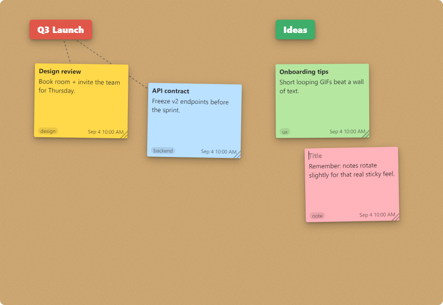

# Post-It Wall

A borderless, always-available desktop wall of freely arranged **post-it notes** and
**headers**. Give the wall a tiled texture, your own image, a solid colour, or make it
**completely transparent** so it blends into your desktop — with an optional
**click-through** mode where empty space passes clicks to whatever is behind it.



Primary target: **Windows desktop**. Built with Electron, so it also runs on macOS/Linux.

## Install

**Windows:** download **`Post-It Wall Setup <version>.exe`** from the
[latest release](https://github.com/HenrikPankoke/Post-It-Wall/releases/latest) and run
it. It's an NSIS installer — you can choose the install location. The app then lives in
the **system tray** (yellow post-it icon).

> The installer is not code-signed, so Windows SmartScreen may show a "Windows protected
> your PC" prompt on first run — choose **More info → Run anyway**.

### Run from source

```bash
npm install
npm start
```

## Why Electron

The specification's hard requirements — a *frameless, transparent* window, the ability
to **click through** empty areas so the desktop behind stays selectable, a **system
tray**, and a rich drag-and-drop note UI — are all first-class in Electron on Windows
(`transparent` + `frame:false` windows, `setIgnoreMouseEvents(…, {forward:true})` for
the seamless-blend feature, `Tray`, and HTML/CSS for the notes).

## Using the wall

The app has no title bar. Hover the **top-left corner** for the toolbar, the
**top-right corner** for the close button, and **right-click** anywhere for a menu.

| Action | How |
| --- | --- |
| **Add a note** | Double-click empty wall · top-left **＋** · right-click → *Add note* · tray |
| **Add a header** | Top-left **H** · right-click → *Add header* · tray |
| **Edit** | Click a note's title / body / tag (or a header) and type — saved automatically |
| **Move** | Drag a note or header from **anywhere on it** (the hand cursor shows it's grabbable) |
| **Resize a note** | Drag the ⌟ grip at its bottom-right |
| **Colour / anchor / link / delete / duplicate** | Select an item → its floating toolbar, or right-click |
| **Anchor (lock in place)** | 📌 — anchored items can't be dragged, and ask for confirmation before deleting |
| **Link a note to a header** | Select note → 🔗 → click a header. Linked notes move with the header and show a dashed connector. Click 🔗 again to unlink |
| **Delete** | Select → `Delete` / `Backspace`, the 🗑 button, or right-click |
| **See how many items exist** | Right-click empty wall — the menu shows the note/header counts (and how many are off-screen) |

### Placement rules

- Notes and headers can never be placed, dragged, or resized **outside** the window.
- **Resizing the window never moves your content** — items keep their exact positions.
  Shrink the window and anything past the edge is simply hidden; grow it back and it
  reappears where you left it.

### The window itself (frameless)

- **Move**: hover the top-left corner → drag the ⠿ handle.
- **Resize**: drag any window **edge or corner**. (A note sitting flush against an edge
  wins those pixels, so you can still grab the note; resize from an empty stretch of the
  edge or a corner.)
- **Close / minimise**: hover the top-right corner for ✕, top-left for minimise.
- **Reset size**: tray → *Reset window size*.

### Window presets (walls 1–5)

The toolbar has five numbered buttons. **Ctrl+click** a number to save the current
window position and size into that slot; **click** it later to snap the window back to
that layout. Presets remember which monitor they were saved on, so you can keep a
different "wall" arrangement per screen and switch between them instantly.

### Backgrounds

Open **⚙ settings** (top-left) or the tray **Background** menu:

- **Sample wall** — four tileable textures (Cork, Linen, Paper grid, Dark slate).
- **Custom image** — pick any picture; *Tile* or *Cover*.
- **Solid colour**, with an **opacity** slider.
- **Transparent** — no background at all (100% see-through).

### Transparent + click-through

With the **Transparent** background, enable **Click-through to desktop**. Empty wall area
then passes mouse clicks straight to the desktop/apps behind — only the notes and headers
stay interactive, so the wall becomes floating sticky notes over your real desktop. While
dragging in transparent mode, a **dashed outline** shows where the (invisible) window edge
is.

## Data & persistence

Everything is stored as JSON in Electron's per-user data folder:

```
%APPDATA%/post-it-wall/postit-wall.json
```

Notes, headers, window bounds, presets, and background settings are saved automatically
(debounced) and flushed on close.

## Build the installer

```bash
npm install
npm run dist
```

`npm run dist` regenerates the app icon (`scripts/build-icon.js` → `build/icon.png`) and
runs **electron-builder**, producing `dist/Post-It Wall Setup <version>.exe` (Windows
NSIS installer).

## Tests

An off-screen integration test boots the real renderer, creates / edits / links / deletes
notes and headers, switches the background, and verifies the full persistence round-trip
including a reload (restart) restore:

```bash
npm test
```

Expected: `19/19 checks passed.`

## Project layout

```
main.js              Main process: transparent frameless window, tray, IPC, JSON storage, presets
preload.js           Narrow contextBridge API (no Node in the renderer)
icon.js              Programmatic app icon (post-it), rendered to PNG at build time
scripts/build-icon.js  Writes build/icon.png from icon.js
renderer/
  index.html         Wall shell, hotzones, toolbar, settings panel, context menu
  styles.css         All styling
  app.js             Notes/headers, drag/resize, linking, click-through, presets, settings
  bg-patterns.js     Tileable sample-wall textures (inline SVG data URLs)
test/smoke-main.js   Off-screen integration test
```

## Notes on the implementation

- **Security**: `contextIsolation` on, `nodeIntegration` off, a CSP in the page, and a
  minimal explicit preload bridge.
- **Single instance**: launching again focuses the existing wall.
- `backgroundThrottling` is disabled so autosave keeps working while the window is
  unfocused (it's meant to sit in the background).

## License

[MIT](LICENSE)
